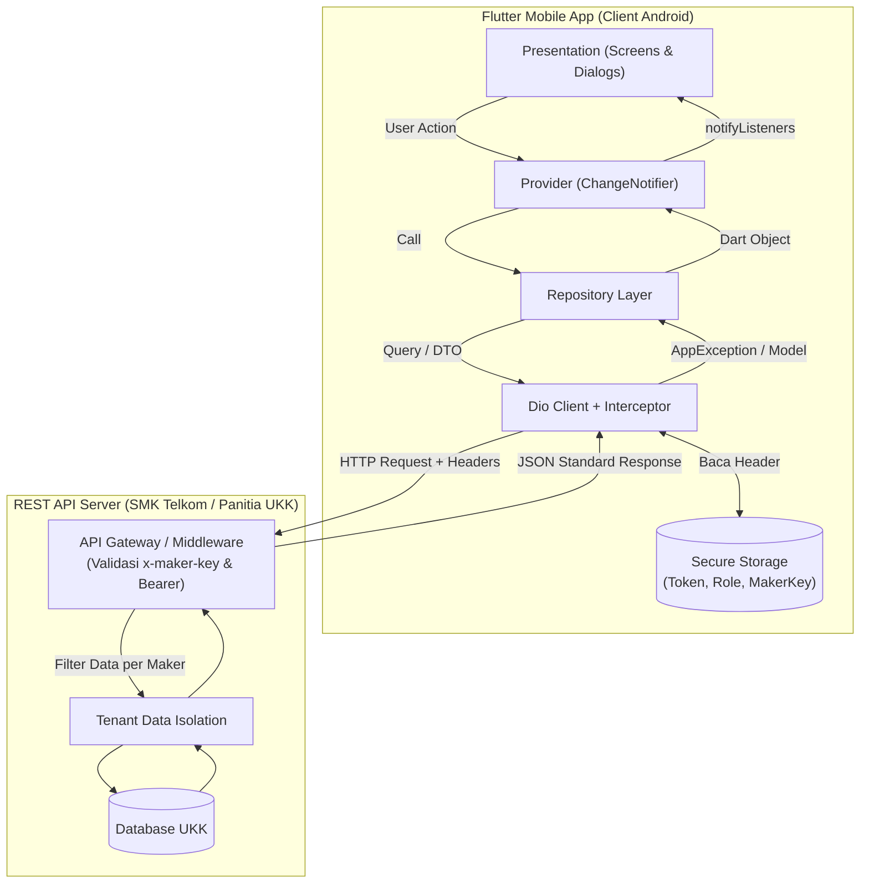
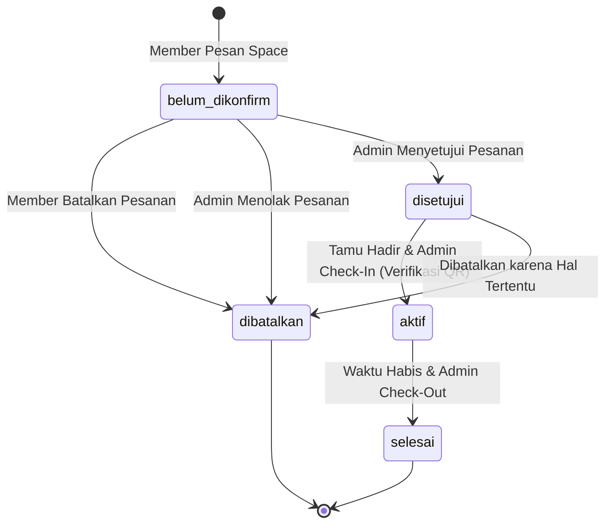
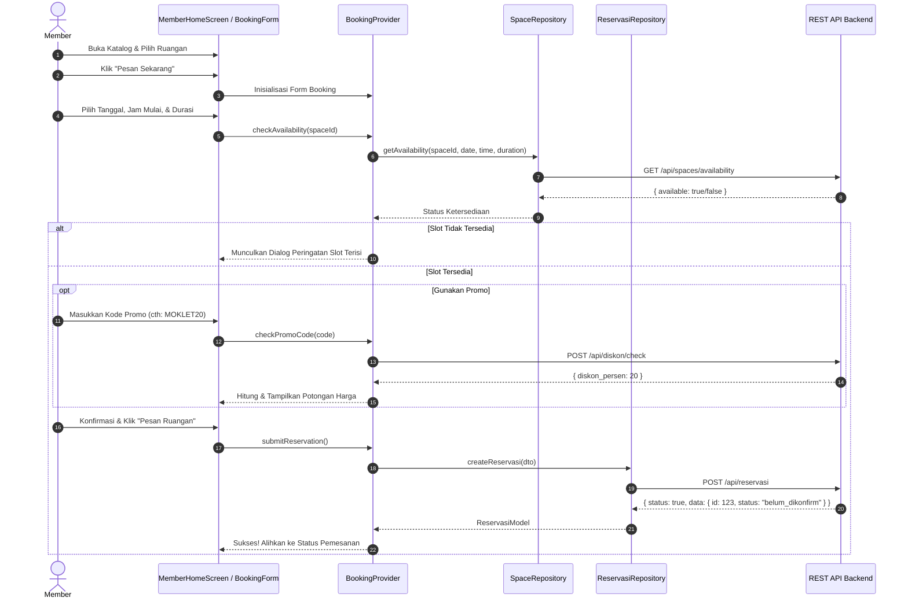
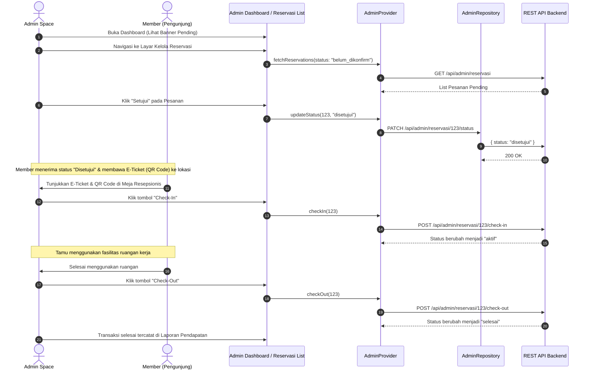
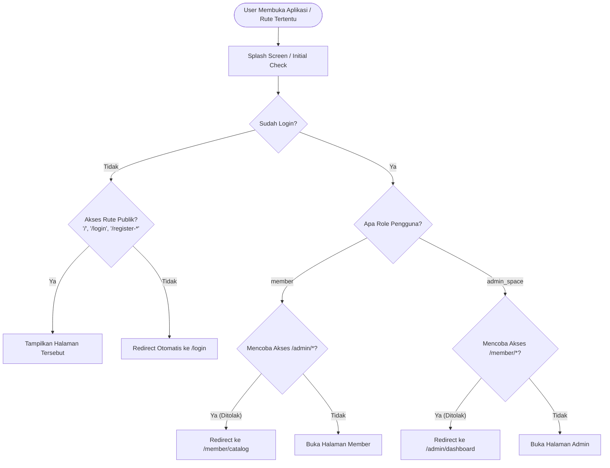

# 🏢 Smart Space Booking — Aplikasi Reservasi Coworking Space & Workstation
### Ujian Kompetensi Keahlian (UKK) RPL 2026/2027 — Paket B

[](https://flutter.dev)
[](https://dart.dev)
[](https://pub.dev/packages/provider)
[](https://pub.dev/packages/go_router)
[](https://pub.dev/packages/dio)
[](https://android.com)

---

## 📑 Daftar Isi

1. [Ringkasan Aplikasi](#-ringkasan-aplikasi)
2. [Fitur Utama Berdasarkan Peran (Roles)](#-fitur-utama-berdasarkan-peran-roles)
   - [A. Peran Member / Pengunjung](#a-peran-member--pengunjung)
   - [B. Peran Admin Pengelola Coworking Space](#b-peran-admin-pengelola-coworking-space)
   - [C. Fitur Khusus & Multi-Tenancy](#c-fitur-khusus--multi-tenancy-x-maker-key)
3. [Arsitektur & Tech Stack](#-arsitektur--tech-stack)
4. [Struktur Folder Proyek](#-struktur-folder-proyek)
5. [Alur Kerja Bisnis & Diagram (Flows)](#-alur-kerja-bisnis--diagram-flows)
   - [1. Arsitektur Komunikasi API Multi-Tenant](#1-arsitektur-komunikasi-api-multi-tenant)
   - [2. Siklus Hidup Status Reservasi (State Machine)](#2-siklus-hidup-status-reservasi-state-machine)
   - [3. Alur End-to-End Reservasi Member](#3-alur-end-to-end-reservasi-member)
   - [4. Alur Operasional Admin (Approval s/d Check-Out)](#4-alur-operasional-admin-approval-sd-check-out)
   - [5. Alur Navigasi & Route Guarding](#5-alur-navigasi--route-guarding)
6. [Integrasi REST API](#-integrasi-rest-api)
   - [Header Standar Request](#header-standar-request)
   - [Format Response Standar](#format-response-standar)
   - [Daftar Endpoint Utama](#daftar-endpoint-utama)
7. [Design System "PLAT"](#-design-system-plat)
8. [Panduan Instalasi & Menjalankan Aplikasi](#-panduan-instalasi--menjalankan-aplikasi)
   - [Prasyarat Sistem](#prasyarat-sistem)
   - [Langkah Instalasi](#langkah-instalasi)
   - [Menjalankan di Emulator / Device](#menjalankan-di-emulator--device)
   - [Build File APK (Pengumpulan Ujian)](#build-file-apk-pengumpulan-ujian)
9. [Kredensial & Panduan Pengujian (Testing)](#-kredensial--panduan-pengujian-testing)
10. [Penanganan Error & Troubleshooting](#-penanganan-error--troubleshooting)

---

## 📖 Ringkasan Aplikasi

**Smart Space Booking** adalah aplikasi mobile client-side modern berbasis **Flutter** yang dibangun untuk memenuhi seluruh spesifikasi **UKK RPL 2026/2027 Paket B**. Aplikasi ini memfasilitasi operasional harian coworking space secara digital, menghubungkan member/pelanggan yang ingin memesan ruang kerja (*Personal Desk*, *Meeting Room*, *Private Office*) dengan pengelola coworking space (*Admin Space*).

Aplikasi beroperasi secara *full-client* dengan mengonsumsi REST API panitia UKK secara multi-tenant (`x-maker-key`), dilengkapi dengan mekanisme penyimpanan sesi aman berenkripsi (`flutter_secure_storage`), manajemen status pemesanan terpadu, pembuatan tiket digital berbasis QR code, serta rekapitulasi laporan pendapatan bulanan bagi pengelola.

---

## 🎯 Fitur Utama Berdasarkan Peran (Roles)

### A. Peran Member / Pengunjung

| No | Fitur | Deskripsi | Layar Terkait |
|:---|:---|:---|:---|
| **M1** | **Registrasi Akun Member** | Daftar akun pelanggan baru (Nama, Instansi, No. Telepon, Alamat, Username, Password, dan Foto Profil). | `RegisterMemberScreen` |
| **M2** | **Autentikasi Login** | Masuk ke akun member dengan username & password via JWT API. Dilengkapi fitur *Auto-Fill* & *Auto-Login* setelah registrasi. | `LoginScreen` |
| **M3** | **Katalog Space & Workstation** | Melihat daftar ruangan kerja lengkap dengan tipe, foto, kapasitas kursi, harga per jam, dan fasilitas. Dilengkapi filter tipe (*All, Desk, Office, Meeting*). | `MemberHomeScreen` |
| **M4** | **Detail Ruangan** | Halaman detail lengkap menampilkan fasilitas, kapasitas, harga sewa, deskripsi, dan tombol aksi pemesanan langsung. | `SpaceDetailScreen` |
| **M5** | **Pengecekan Ketersediaan Real-Time** | Memilih tanggal, jam mulai (preset & custom), dan durasi penggunaan (jam). Sistem otomatis memeriksa ketersediaan slot ke API untuk mencegah *double booking*. | `BookingFormScreen` |
| **M6** | **Klaim Diskon / Promo Otomatis** | Memasukkan kode promo atau memilih dari daftar voucher aktif untuk mendapatkan potongan harga persentase secara instan. | `BookingFormScreen` |
| **M7** | **Ringkasan Checkout Transparan** | Breakdown biaya pemesanan (Subtotal, Nilai Diskon Promo, dan Total Akhir Pembayaran) sebelum konfirmasi pesanan. | `BookingFormScreen` |
| **M8** | **Pemantauan Status Pemesanan** | Memantau seluruh pesanan aktif dengan badge status (*Belum Dikonfirmasi, Disetujui, Aktif, Selesai, Dibatalkan*). | `MemberBookingStatusScreen` |
| **M9** | **Pembatalan Pemesanan** | Membatalkan reservasi mandiri selama pesanan belum diproses/aktif oleh pihak admin. | `MemberBookingStatusScreen` |
| **M10**| **E-Ticket Pass & QR Code** | Setelah disetujui, member memperoleh tiket digital lengkap dengan QR Code (`qr_flutter`) untuk di-scan petugas saat check-in. | `ETicketScreen` |
| **M11**| **Histori Pemesanan & Pengeluaran** | Riwayat transaksi pemesanan masa lalu yang dapat difilter per bulan dan tahun, lengkap dengan akumulasi total rupiah yang telah dibelanjakan. | `MemberHistoryScreen` |
| **M12**| **Profil Pengguna & Logout** | Melihat data akun, instansi, kontak, mengakses dialog konfigurasi server, serta keluar akun dengan aman. | `MemberProfileScreen` |

---

### B. Peran Admin Pengelola Coworking Space

| No | Fitur | Deskripsi | Layar Terkait |
|:---|:---|:---|:---|
| **A1** | **Registrasi Admin & Lokasi** | Mendaftarkan akun pengelola sekaligus identitas lokasi coworking space (Nama Space, Nama Pemilik, Alamat, No. Telp, Deskripsi). | `RegisterAdminScreen` |
| **A2** | **Dashboard Operasional Real-Time** | Ringkasan statistik cepat: Total Ruangan, Total Member Terdaftar, Jumlah Reservasi Pending, Promo Aktif, dan Pendapatan Bulan Ini. | `AdminDashboardScreen` |
| **A3** | **Notifikasi Banner Pending Approval** | Banner peringatan mencolok di puncak dashboard jika terdapat reservasi member yang butuh persetujuan segera. | `AdminDashboardScreen` |
| **A4** | **Kelola Reservasi Terpadu** | Memfilter reservasi berdasarkan Bulan, Tahun, dan Status (`belum_dikonfirm`, `disetujui`, `aktif`, `selesai`, `dibatalkan`). | `AdminReservasiListScreen` |
| **A5** | **Alur Operasional Tamu** | Melakukan aksi satu klik: **Setujui / Tolak** pesanan masuk, **Check-In** tamu saat hadir di lokasi, dan **Check-Out** saat selesai. | `AdminReservasiListScreen` |
| **A6** | **CRUD Master Data Space** | Menambah, mengubah, dan menghapus space/ruangan beserta tipe, kapasitas, harga/jam, deskripsi, dan upload foto via Multipart. | `AdminManagementScreen` (Tab 0) |
| **A7** | **CRUD Master Data Member** | Menambah pelanggan secara manual, mengedit data pelanggan, mengganti password, atau menghapus member. | `AdminManagementScreen` (Tab 1) |
| **A8** | **CRUD Master Data Diskon / Promo** | Membuat kode kupon diskon baru (Kode Promo, Persentase Diskon, Tanggal Mulai, dan Tanggal Berakhir). | `AdminManagementScreen` (Tab 2) |
| **A9** | **Rekapitulasi Pendapatan Bulanan** | Laporan pendapatan total, jumlah transaksi selesai, rata-rata transaksi, dan grafik perbandingan pendapatan per tipe ruangan. | `AdminIncomeReportScreen` |
| **A10**| **Edit Profil Coworking Space** | Memperbarui nama lokasi, pemilik, alamat, dan nomor kontak hotline yang tampil di katalog member. | `AdminProfileEditScreen` |

---

### C. Fitur Khusus & Multi-Tenancy (`x-maker-key`)

1. **Multi-Tenancy UKK Built-In**:
   - Seluruh request API secara otomatis diinjeksi header `x-maker-key` dan `x-app-key` untuk menjamin isolasi data antar peserta ujian.
2. **Modal Konfigurasi Server Dinamis (`ServerConfigDialog`)**:
   - Dapat diakses dari pojok kanan atas layar Splash, Login, Dashboard Admin, maupun Profil Member.
   - Mengizinkan penguji/pengguna mengubah **API Base URL** dan **Maker App Key** secara *runtime* tanpa perlu re-compile aplikasi.
3. **Pendaftaran App Maker Otomatis**:
   - Jika peserta/penguji belum memiliki App Key, form registrasi App Maker (`/api/maker/register`) dapat dijalankan langsung di dalam dialog konfigurasi untuk mendapatkan key baru secara instan.
4. **Penyimpanan Terenkripsi**:
   - Menggunakan `flutter_secure_storage` untuk menyimpan JWT access token, role aktif, data user cache, dan maker key.

---

## 🏗 Arsitektur & Tech Stack

Aplikasi menerapkan variasi **Clean Architecture / Layered Architecture** yang dipadukan dengan **Repository Pattern**. Struktur ini memisahkan secara tegas antara tampilan antarmuka (Presentation), logika bisnis (State Management Provider), gerbang data (Repository), dan fondasi infrastruktur (Core).

```
┌──────────────────────────────────────────────────────────┐
│                   PRESENTATION LAYER                     │
│  Screens, Stateful Shell Routes, Custom Widgets, Forms   │
└────────────────────────────┬─────────────────────────────┘
                             │ (Listen / Dispatch)
┌────────────────────────────▼─────────────────────────────┐
│                 STATE MANAGEMENT (PROVIDER)              │
│  AuthProvider, SpaceProvider, BookingProvider,           │
│  ReservasiProvider, AdminProvider                        │
└────────────────────────────┬─────────────────────────────┘
                             │ (Invoke Method / DTO)
┌────────────────────────────▼─────────────────────────────┐
│                     REPOSITORY LAYER                     │
│  AuthRepo, SpaceRepo, ReservasiRepo, AdminRepo, etc.     │
└────────────────────────────┬─────────────────────────────┘
                             │ (HTTP Call / Storage)
┌────────────────────────────▼─────────────────────────────┐
│                        CORE LAYER                        │
│  DioClient (Interceptors), SecureStorage, AppException   │
└────────────────────────────┬─────────────────────────────┘
                             │ (HTTPS Request)
┌────────────────────────────▼─────────────────────────────┐
│                 REST API BACKEND (PANITIA)               │
└──────────────────────────────────────────────────────────┘
```

### Rincian Dependensi Utama (`pubspec.yaml`):

| Paket | Versi | Peran & Kegunaan |
|:---|:---|:---|
| `provider` | `^6.1.5` | State management reaktif (`ChangeNotifierProvider`, `context.watch`, `context.read`). |
| `go_router` | `^17.0.0` | Routing deklaratif, sub-rute bertingkat, dan *Route Guarding* berbasis status autentikasi & role. |
| `dio` | `^5.11.1` | HTTP client tangguh dengan dukungan request/response interceptor dan upload multipart form data. |
| `flutter_secure_storage` | `^10.3.4` | Keamanan lokal: enkripsi Keychain (iOS) & Keystore / AES (Android) untuk JWT Token & App Key. |
| `qr_flutter` | `^4.1.0` | Rendering grafis QR Code beresolusi tinggi pada E-Ticket reservasi. |
| `google_fonts` | `^6.3.2` | Tipografi modern: *Plus Jakarta Sans* untuk UI modern dan *Space Grotesk* untuk aksen arsitektural. |
| `intl` | `^0.20.2` | Formatting tanggal bahasa Indonesia (`id_ID`) dan standardisasi format mata uang Rupiah (`Rp`). |
| `cached_network_image` | `^3.4.1` | Caching gambar jaringan secara efisien untuk foto ruangan dan profil. |
| `image_picker` | `^1.2.1` | Mengambil foto dari galeri/kamera untuk upload foto ruangan dan profil member. |

---

## 📁 Struktur Folder Proyek

Berikut adalah hierarki lengkap direktori kode sumber (`lib/`):

```
lib/
├── main.dart                                  # Entry point aplikasi, inisialisasi lokal, MultiProvider root
├── core/                                      # Fondasi & utilitas sentral sistem
│   ├── constants/
│   │   ├── api_endpoints.dart                 # Registry semua path URL REST API backend & default config
│   │   └── app_colors.dart                    # Design System palet warna, mapping warna status & background
│   ├── errors/
│   │   └── app_exception.dart                 # Custom exception wrapper mengubah error API/Dio menjadi pesan ramah
│   ├── network/
│   │   ├── api_response.dart                  # Generic API wrapper {status, statusCode, message, data}
│   │   └── dio_client.dart                    # Singleton Dio client dengan interceptor x-maker-key & Bearer Token
│   ├── router/
│   │   └── app_router.dart                    # GoRouter konfigurasi: StatefulShellRoute, route guards per role
│   └── storage/
│       └── secure_storage_service.dart        # Enkripsi & pembacaan token, role, base URL, dan app key
│
├── data/                                      # Layer data (Model DTO & Repository)
│   ├── models/
│   │   ├── user_model.dart                    # Model Member, Admin Space, dan profil owner
│   │   ├── space_model.dart                   # Model Ruangan/Space (Desk, Meeting, Office)
│   │   ├── diskon_model.dart                  # Model Diskon & Voucher Promo
│   │   ├── reservasi_model.dart               # Model Transaksi Reservasi lengkap relasi Space & Member
│   │   ├── e_ticket_model.dart                # Model E-Ticket pass & QR code payload
│   │   ├── report_model.dart                  # Model Laporan Pendapatan Bulanan & Breakdown
│   │   └── maker_model.dart                   # Model registrasi pengembang multi-tenant
│   └── repositories/
│       ├── auth_repository.dart               # API auth (login, register member, register admin, profile)
│       ├── space_repository.dart              # API space (katalog, tipe, cek ketersediaan, upload foto)
│       ├── diskon_repository.dart             # API promo (cek diskon aktif, verifikasi kode voucher)
│       ├── reservasi_repository.dart          # API pemesanan (buat booking, riwayat, e-ticket, pembatalan)
│       ├── admin_repository.dart              # API admin (CRUD space/member/diskon, status update, check-in/out, report)
│       └── maker_repository.dart              # API registrasi App Maker (x-maker-key generator)
│
├── presentation/                              # Layer antarmuka & interaksi pengguna
│   ├── member/                                # Modul khusus Pengunjung / Member
│   │   ├── main_layout/
│   │   │   └── member_main_layout.dart        # Scaffold tab navigasi bawah (Katalog, Status, Histori, Profil)
│   │   ├── space_catalog/
│   │   │   ├── member_home_screen.dart        # Layar katalog utama dengan pencarian & filter tipe space
│   │   │   └── space_detail_screen.dart       # Layar detail spek ruangan, harga sewa, & fasilitas
│   │   ├── booking/
│   │   │   └── booking_form_screen.dart       # Layar booking: pemilih tanggal, slot jam, durasi, dan diskon
│   │   ├── booking_status/
│   │   │   └── member_booking_status_screen.dart # Pemantauan status reservasi & tombol batalkan/e-ticket
│   │   ├── booking_history/
│   │   │   └── member_history_screen.dart     # Riwayat reservasi bulanan & ringkasan pengeluaran
│   │   ├── e_ticket/
│   │   │   └── e_ticket_screen.dart           # Layar tiket digital dengan rendering QR Code & instruksi check-in
│   │   ├── profile/
│   │   │   └── member_profile_screen.dart     # Layar profil identitas member & pengaturan
│   │   └── register/
│   │       └── register_member_screen.dart    # Formulir pendaftaran akun member baru
│   │
│   ├── admin/                                 # Modul khusus Pengelola / Admin Space
│   │   ├── main_layout/
│   │   │   └── admin_main_layout.dart         # Scaffold tab navigasi bawah (Dashboard, Reservasi, Master, Laporan)
│   │   ├── dashboard/
│   │   │   └── admin_dashboard_screen.dart    # Dashboard ringkasan metrik, banner pending, & shortcut
│   │   ├── reservasi_list/
│   │   │   └── admin_reservasi_list_screen.dart # Manajemen pesanan: filter bulan/status, setujui, tolak, check-in/out
│   │   ├── management/
│   │   │   └── admin_management_screen.dart   # Layar tab CRUD Master Data: Space, Member, dan Promo
│   │   ├── income_report/
│   │   │   └── admin_income_report_screen.dart# Laporan rekapitulasi finansial & grafik proporsi space
│   │   ├── profile/
│   │   │   └── admin_profile_edit_screen.dart # Formulir update profil coworking space (nama, kontak, alamat)
│   │   └── register/
│   │       └── register_admin_screen.dart     # Formulir pendaftaran admin space & lokasi baru
│   │
│   └── shared/                                # Komponen bersama antar role
│       ├── screens/
│       │   ├── splash_screen.dart             # Splash screen dengan visual coworking & inisialisasi sesi
│       │   └── login_screen.dart              # Layar login terpadu (Member & Admin) + auto login
│       ├── providers/
│       │   ├── auth_provider.dart             # Global state untuk sesi pengguna, token, role, dan maker key
│       │   ├── space_provider.dart            # State katalog space & filter tipe
│       │   ├── booking_provider.dart          # State proses formulir booking, slot availability, voucher
│       │   ├── reservasi_provider.dart        # State pesanan member, histori, e-ticket, dan pembatalan
│       │   └── admin_provider.dart            # State operasional admin, list reservasi, CRUD data, dan laporan
│       └── widgets/
│           ├── custom_button.dart             # Tombol interaktif dengan state loading & elevation
│           ├── custom_text_field.dart         # Input field seragam dengan ikon, validasi, dan styling
│           ├── server_config_dialog.dart      # Dialog modal konfigurasi dinamis Base URL & Maker Key
│           └── status_badge.dart              # Badge status reservasi dengan palet semantik seragam
│
└── utils/                                     # Utility murni (Helper functions)
    ├── formatters.dart                        # Pemformat Rupiah, tanggal Bahasa Indonesia, dan jam
    └── validators.dart                        # Validasi regex username, nomor telepon, password, dan angka
```

---

## 🔄 Alur Kerja Bisnis & Diagram (Flows)

### 1. Arsitektur Komunikasi API Multi-Tenant

Setiap request dari aplikasi client Flutter menyertakan identitas aplikasi siswa (`x-maker-key`) dan kredensial pengguna (`Authorization: Bearer <token>`):



---

### 2. Siklus Hidup Status Reservasi (State Machine)

Status reservasi bergerak secara linear dan aman sesuai operasional di lapangan:



---

### 3. Alur End-to-End Reservasi Member



---

### 4. Alur Operasional Admin (Approval s/d Check-Out)



---

### 5. Alur Navigasi & Route Guarding

`go_router` menjamin keamanan akses berdasarkan status login dan role akun pengguna:



---

## 🌐 Integrasi REST API

### Header Standar Request

Setiap panggilan keluar melalui `DioClient` secara otomatis menyertakan:

```http
Content-Type: application/json
Accept: application/json
x-maker-key: mk_41bfa558160149fa8c39399e690ac8b5
Authorization: Bearer <access_token_jwt>   # (Pada endpoint terproteksi)
```

### Format Response Standar

Backend panitia memberikan format baku yang ditangani secara terpusat oleh `ApiResponse<T>`:

```json
// Response Sukses
{
  "status": true,
  "statusCode": 200,
  "message": "Data berhasil diambil",
  "data": { ... },
  "timestamp": "2026-09-21T18:00:00.000Z"
}

// Response Gagal / Validasi
{
  "status": false,
  "statusCode": 400,
  "message": "Slot waktu sudah terisi oleh pemesanan lain",
  "error": "Bad Request",
  "timestamp": "2026-09-21T18:00:00.000Z"
}
```

### Daftar Endpoint Utama

| Kategori | Method | Endpoint | Deskripsi |
|:---|:---|:---|:---|
| **Maker** | `POST` | `/api/maker/register` | Mendaftarkan app maker siswa & memperoleh `app_key` |
| **Auth** | `POST` | `/api/auth/register/member` | Mendaftarkan member baru |
| **Auth** | `POST` | `/api/auth/register/admin-space` | Mendaftarkan admin space & profil coworking |
| **Auth** | `POST` | `/api/auth/login` | Login user (menghasilkan JWT token & data role) |
| **Auth** | `GET` | `/api/auth/profile` | Mengambil profil user yang sedang login |
| **Spaces**| `GET` | `/api/spaces` | Mengambil katalog ruangan coworking |
| **Spaces**| `GET` | `/api/spaces/types` | Mengambil daftar tipe space yang tersedia |
| **Spaces**| `GET` | `/api/spaces/availability` | Memeriksa ketersediaan slot (space_id, tanggal, jam, durasi) |
| **Promo** | `POST` | `/api/diskon/check` | Memvalidasi kode kupon promo |
| **Booking**| `POST` | `/api/reservasi` | Membuat pemesanan reservasi baru |
| **Booking**| `GET` | `/api/reservasi/my` | Mengambil daftar pesanan aktif member |
| **Booking**| `GET` | `/api/reservasi/my/history`| Mengambil riwayat transaksi member (filter bulan/tahun) |
| **Booking**| `GET` | `/api/reservasi/{id}/e-ticket` | Mengambil data e-ticket & QR Code |
| **Booking**| `PATCH`| `/api/reservasi/{id}/cancel` | Membatalkan reservasi oleh member |
| **Admin** | `GET` | `/api/admin/profile` | Mengambil profil lokasi coworking space |
| **Admin** | `PUT` | `/api/admin/profile` | Memperbarui profil lokasi coworking space |
| **Admin** | `CRUD`| `/api/admin/spaces` | Mengelola data space (GET, POST, PUT, DELETE) |
| **Admin** | `CRUD`| `/api/admin/members` | Mengelola data member pelanggan (GET, POST, PUT, DELETE) |
| **Admin** | `CRUD`| `/api/admin/diskon` | Mengelola data kode promo diskon (GET, POST, PUT, DELETE) |
| **Admin** | `GET` | `/api/admin/reservasi` | Mengambil semua reservasi (filter bulan, tahun, status) |
| **Admin** | `PATCH`| `/api/admin/reservasi/{id}/status` | Mengubah status pesanan (`disetujui`, `dibatalkan`) |
| **Admin** | `POST` | `/api/admin/reservasi/{id}/check-in` | Melakukan check-in tamu yang hadir |
| **Admin** | `POST` | `/api/admin/reservasi/{id}/check-out`| Melakukan check-out tamu yang selesai |
| **Admin** | `GET` | `/api/admin/reports/monthly` | Mengambil ringkasan rekapitulasi finansial bulanan |
| **Upload** | `POST` | `/api/upload/spaces` | Upload foto ruangan (Multipart File) |
| **Upload** | `POST` | `/api/upload/members` | Upload foto profil pelanggan |

---

## 🎨 Design System "PLAT"

Aplikasi ini didesain menggunakan filosofi arsitektural ruang fisik nyata yang diberi nama sistem **PLAT (Papan Lokasi & Alokasi Tempat)**, menghindari tampilan template SaaS generik:

### 1. Palet Warna (`AppColors`)

| Token Warna | Nilai Hex | Peran & Penggunaan |
|:---|:---|:---|
| `primaryNavy` | `#0F2C41` | Warna brand utama, AppBar, Card gelap, tombol aksi utama. |
| `navyDark` | `#091B28` | Background splash & elemen status bar gelap. |
| `primaryYellow` | `#E59B24` | Aksen kuningan (*brass*), highlight diskon, ikon aktif, CTA. |
| `yellowLight` | `#FFF3D6` | Aksen kontras lembut & latar belakang ikon. |
| `bgLight` | `#FAF8F5` | Latar belakang kanvas aplikasi (*warm stone/plaster*). |
| `cardBg` | `#FFFFFF` | Permukaan kartu dengan border halus (*hairline border*). |
| `textPrimary` | `#0F172A` | Warna tipografi teks utama berdaya baca tinggi. |
| `textSecondary`| `#64748B` | Teks keterangan, caption, dan metadata sekunder. |

### 2. Warna Semantik Status Reservasi

| Status API | Label UI | Warna Aksen | Latar Belakang | Makna |
|:---|:---|:---|:---|:---|
| `belum_dikonfirm` | **Belum Dikonfirmasi** | `#F59E0B` (Amber) | `#FEF3C7` | Menunggu verifikasi admin |
| `disetujui` | **Disetujui** | `#3B82F6` (Blue) | `#EFF6FF` | Disetujui, E-ticket siap |
| `aktif` | **Sedang Aktif** | `#10B981` (Emerald) | `#ECFDF5` | Tamu sedang di lokasi |
| `selesai` | **Selesai** | `#8B5CF6` (Purple) | `#F3E8FF` | Transaksi tuntas |
| `dibatalkan` | **Dibatalkan** | `#EF4444` (Rose) | `#FEF2F2` | Ditolak atau dibatalkan |

### 3. Tipografi
- **Plus Jakarta Sans / IBM Plex Sans**: Tipografi utama yang sangat nyaman dibaca pada ukuran layar kecil.
- **Space Grotesk**: Digunakan pada heading, nomor ruangan, dan plakat judul layar.
- **Monospace (Tabular figures)**: Digunakan secara eksklusif untuk data literal kode (*Kode Reservasi*, *Nomor Tiket*, dan *QR Payload*).

---

## 🚀 Panduan Instalasi & Menjalankan Aplikasi

### Prasyarat Sistem
Pastikan perangkat pengembangan telah terpasang:
- **Flutter SDK**: `^3.8.0` atau yang lebih baru ([Unduh Flutter](https://docs.flutter.dev/get-started/install))
- **Dart SDK**: Terbawa otomatis bersama Flutter
- **Android Studio / VS Code** lengkap dengan ekstensi Flutter & Dart
- **Android SDK Platform**: Target Android 10+ (API Level 29 ke atas)
- Koneksi Internet aktif untuk berkomunikasi dengan REST API

---

### Langkah Instalasi

1. **Buka Terminal / Command Prompt** dan arahkan ke direktori proyek:
   ```bash
   cd "c:\Flutter Zea\ukk_2026"
   ```

2. **Periksa Kesiapan Lingkungan Flutter**:
   ```bash
   flutter doctor
   ```

3. **Unduh Seluruh Dependensi Proyek**:
   ```bash
   flutter pub get
   ```

---

### Menjalankan di Emulator / Device

1. Pastikan emulator Android telah berjalan atau perangkat fisik terhubung via USB Debugging:
   ```bash
   flutter devices
   ```

2. Jalankan aplikasi dalam mode pengembangan:
   ```bash
   flutter run
   ```

3. **Konfigurasi Server Saat Ujian**:
   - Jika panitia memberikan Base URL atau App Key baru saat ujian dimulai, tekan **ikon gerigi (pengaturan)** di pojok kanan atas layar Splash atau Login.
   - Masukkan **API Base URL** dan **x-maker-key** yang diberikan panitia, lalu klik **Simpan Konfigurasi**.

---

### Build File APK (Pengumpulan Ujian)

Untuk mengompilasi aplikasi menjadi file APK mandiri yang siap diserahkan kepada penguji:

#### 1. Build APK Debug (Disarankan untuk UKK):
```bash
flutter build apk --debug
```
*Lokasi hasil build:*  
`build/app/outputs/flutter-apk/app-debug.apk`

#### 2. Build APK Release (Versi Teroptimasi Penuh):
```bash
flutter build apk --release
```
*Lokasi hasil build:*  
`build/app/outputs/flutter-apk/app-release.apk`

---

## 🧪 Kredensial & Panduan Pengujian (Testing)

### 1. Pengaturan Awal Multi-Tenancy
- **Default Base URL**: `https://learn.smktelkom-mlg.sch.id/coworking`
- **Default App Key**: `mk_41bfa558160149fa8c39399e690ac8b5`
- *Catatan:* Anda juga dapat menekan "Belum punya App Key? Buat Maker Baru" pada dialog konfigurasi untuk membuat app key baru khusus untuk pengujian Anda.

### 2. Panduan Menguji Role Member:
1. Buka aplikasi, pada layar Login klik **"Buat Akun Member"**.
2. Isi formulir pendaftaran:
   - Nama: `Ahmad Siswa`
   - Instansi: `SMK Telkom Malang`
   - Telepon: `081234567890`
   - Username: `membertest`
   - Password: `password123`
3. Klik **"Daftar Sekarang"** — sistem akan otomatis melakukan *Auto-Login* dan mengarahkan langsung ke Katalog Space.
4. Pilih salah satu ruangan (misal: *Meeting Room Alpha*).
5. Klik **"Pesan Ruangan"**, pilih jam mulai dan durasi sewa.
6. (Opsional) Masukkan kode promo `MOKLET20` atau promo yang aktif.
7. Konfirmasi pemesanan. Periksa status di tab **"Pesanan"** (status awal: `Belum Dikonfirmasi`).

### 3. Panduan Menguji Role Admin Space:
1. Logout dari akun member, lalu klik **"Daftar sebagai Admin Space"**.
2. Isi identitas pengelola dan coworking space:
   - Nama Coworking: `Moklet Creative Hub`
   - Nama Pemilik: `Budi Pengelola`
   - Username: `admintest`
   - Password: `password123`
3. Masuk ke Dashboard Admin.
4. Perhatikan notifikasi pesanan pending di bagian atas dashboard.
5. Buka tab **"Reservasi"**, klik tombol **"Setujui"** pada pesanan `membertest`.
6. Buka kembali akun member untuk melihat tiket digital yang kini memiliki tombol **"Lihat E-Ticket"** lengkap dengan QR Code.
7. Kembali ke akun admin, lakukan aksi **"Check-In"** (status berubah menjadi `Aktif`), lalu lakukan **"Check-Out"** (status berubah menjadi `Selesai`).
8. Buka tab **"Laporan"** pada menu Admin untuk memeriksa akumulasi pendapatan yang otomatis bertambah.

---

## 🛠 Penanganan Error & Troubleshooting

| Gejala Masalah | Penyebab Umum | Solusi / Cara Mengatasi |
|:---|:---|:---|
| **401 Unauthorized** | Token sesi login telah berakhir atau tidak valid. | Logout dan login kembali untuk mendapatkan token baru. |
| **403 Forbidden (Maker Key Invalid)** | Header `x-maker-key` salah atau belum diatur. | Buka dialog pengaturan server (ikon gerigi) dan masukkan App Key yang valid atau buat Maker baru. |
| **Slot Sudah Ada Bookingan** | Jam atau durasi yang dipilih bertabrakan dengan jadwal orang lain. | Pilih jam mulai lain atau kurangi durasi sewa sesuai slot yang masih kosong. |
| **Gambar Tidak Tampil** | URL foto server tidak terjangkau atau format link belum di-resolve. | Aplikasi telah dilengkapi fallback ikon otomatis sesuai tipe space jika gambar gagal dimuat dari server. |
| **Connection Timeout / SocketException** | Koneksi internet terputus atau server panitia sedang *maintenance*. | Periksa koneksi internet perangkat dan pastikan Base URL di dialog pengaturan sesuai dengan server yang aktif. |

---

<div align="center">
  <b>Smart Space Booking — Solusi Coworking Space Cerdas & Terintegrasi</b><br/>
  Dibuat dengan ❤️ untuk Ujian Kompetensi Keahlian (UKK) Rekayasa Perangkat Lunak 2026/2027
</div>
