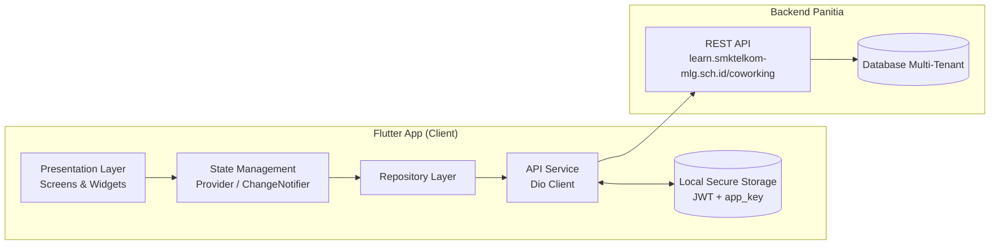
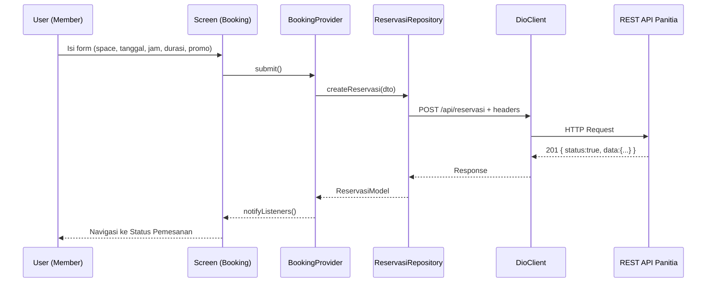

# Dokumen Arsitektur Teknis
## Smart Space Booking — Aplikasi Mobile (Flutter)

| | |
|---|---|
| **Proyek** | UKK RPL 2026/2027 — Paket B |
| **Platform** | Flutter (Dart) — Android target Android 10+ |
| **Pola Arsitektur** | Layered Architecture (Presentation → Domain → Data) + Repository Pattern |
| **State Management** | Provider (ChangeNotifier) |
| **Networking** | Dio + Interceptor |
| **Status Dokumen** | Draft v1.0 |

---

## 1. Gambaran Umum

Aplikasi ini adalah **client murni** yang mengonsumsi REST API yang disediakan panitia. Tidak ada backend/database lokal selain penyimpanan sesi (token & app_key) di perangkat.



Setiap request keluar wajib membawa header:
- `x-maker-key: <app_key>` — isolasi data per siswa (multi-tenancy).
- `Authorization: Bearer <access_token>` — untuk endpoint yang butuh login (member/admin).

## 2. Tech Stack

| Layer | Pilihan | Alasan |
|---|---|---|
| Bahasa & Framework | Flutter (Dart) | Cross-platform, sesuai kategori Mobile App |
| HTTP Client | `dio` | Mendukung interceptor untuk header otomatis & error handling terpusat |
| State Management | `provider` | Ringan, cukup untuk skala UKK (7+9 layar), kurva belajar rendah |
| Navigasi | `go_router` | Routing deklaratif, mudah handle guard (redirect ke login jika belum auth) |
| Penyimpanan Sesi | `flutter_secure_storage` | Menyimpan JWT & app_key secara terenkripsi, bukan `SharedPreferences` biasa |
| Formatter Tanggal/Waktu | `intl` | Format tanggal (`yyyy-MM-dd`) & jam (`HH:mm`) sesuai kontrak API |
| Gambar | `cached_network_image` + `image_picker` | Menampilkan foto space/member dari `foto_url` & memilih foto saat upload |
| QR Code | `qr_flutter` | Menampilkan QR Code pada layar E-Ticket dari `qr_code_payload` |
| Form Validasi | `flutter_form_builder` (opsional) atau validasi manual | Validasi input register/reservasi |

## 3. Struktur Folder (Clean-ish Architecture)

```
lib/
├── main.dart
├── app.dart                         # MaterialApp.router, tema, provider root
├── core/
│   ├── constants/
│   │   ├── api_endpoints.dart       # Semua path endpoint (base_url dari .env/config)
│   │   └── app_colors.dart
│   ├── network/
│   │   ├── dio_client.dart          # Instance Dio + interceptor (x-maker-key, Bearer)
│   │   └── api_response.dart        # Wrapper generik {status, statusCode, message, data}
│   ├── storage/
│   │   └── secure_storage_service.dart  # simpan/baca app_key & token
│   ├── errors/
│   │   └── app_exception.dart       # Mapping error API → pesan ramah pengguna
│   └── router/
│       └── app_router.dart          # go_router + redirect guard (member/admin)
│
├── data/
│   ├── models/
│   │   ├── user_model.dart
│   │   ├── space_model.dart
│   │   ├── diskon_model.dart
│   │   ├── reservasi_model.dart
│   │   └── report_model.dart
│   └── repositories/
│       ├── auth_repository.dart
│       ├── maker_repository.dart
│       ├── space_repository.dart
│       ├── diskon_repository.dart
│       ├── reservasi_repository.dart
│       └── admin_repository.dart
│
├── presentation/
│   ├── member/
│   │   ├── register/
│   │   ├── login/
│   │   ├── space_catalog/           # Layar 3: Ketersediaan Space
│   │   ├── booking/                 # Layar 4: Pesan Space
│   │   ├── booking_status/          # Layar 5: Status Pemesanan
│   │   ├── booking_history/         # Layar 6: Histori Pemesanan
│   │   └── e_ticket/                # Layar 7: E-Ticket
│   ├── admin/
│   │   ├── register/
│   │   ├── login/
│   │   ├── profile/                 # Layar 3: Profil Lokasi
│   │   ├── member_crud/             # Layar 4: Data Member
│   │   ├── diskon_crud/             # Layar 5: Data Diskon
│   │   ├── reservasi_detail/        # Layar 7: Kelola Reservasi
│   │   ├── reservasi_list/          # Layar 8: Semua Reservasi (Filter)
│   │   └── income_report/           # Layar 9: Rekapitulasi Pendapatan
│   └── shared/
│       ├── widgets/                 # Button, TextField, Card, LoadingIndicator
│       └── providers/               # AuthProvider (state login global)
│
└── utils/
    ├── validators.dart
    └── formatters.dart              # format Rupiah, tanggal, jam
```

## 4. Penjelasan Layer

### 4.1 Presentation Layer
Berisi Screen (widget halaman) dan Provider lokal per fitur. Screen **tidak** langsung memanggil Dio — selalu lewat Repository, agar UI tetap bersih dan mudah diuji.

### 4.2 State Management (Provider)
- `AuthProvider` (global, di-`provide` di root `app.dart`): menyimpan role aktif (`member`/`admin_space`), token, dan status login. Dipakai oleh `go_router` redirect guard.
- Provider per fitur (mis. `BookingProvider`, `SpaceCatalogProvider`) dibuat scoped di masing-masing screen menggunakan `ChangeNotifierProvider` agar tidak membebani root.

### 4.3 Data Layer — Repository Pattern
Repository menjadi satu-satunya pintu ke API, menerjemahkan response JSON mentah ke Model Dart, dan melempar `AppException` yang sudah diterjemahkan (misalnya status 400 → pesan `message` dari API langsung ditampilkan ke user).

Contoh alur `ReservasiRepository.createReservasi()`:
```
Screen → BookingProvider.submit() → ReservasiRepository.create(dto)
→ DioClient.post('/api/reservasi', data: dto.toJson())
→ ApiResponse.fromJson(response) → ReservasiModel.fromJson(data['data'])
→ return ke Provider → notifyListeners() → UI update
```

### 4.4 Core — Network Interceptor
`dio_client.dart` memasang `InterceptorsWrapper` yang otomatis:
1. Menambahkan header `x-maker-key` dari `SecureStorageService` ke **setiap** request.
2. Menambahkan header `Authorization: Bearer <token>` jika token tersedia di storage.
3. Menangkap error non-2xx dan membungkusnya menjadi `AppException(message, statusCode)` memakai field `message` dari body error API (format baku `{status:false, message, error}`).

## 5. Model Data (mapping dari Kontrak API)

| Model Dart | Sumber DTO / Entity API |
|---|---|
| `MemberModel` | `RegisterMemberDto`, `member` object pada response auth |
| `AdminSpaceModel` | `RegisterAdminSpaceDto`, `space_owner` object |
| `SpaceModel` | `CreateSpaceDto` / `UpdateSpaceDto` + field `foto_url` |
| `DiskonModel` | `CreateDiskonDto` / `UpdateDiskonDto` |
| `ReservasiModel` | `CreateReservasiDto` + `Reservasi & Payment Entity` (Bagian III.2.16) |
| `ETicketModel` | Response `GET /api/reservasi/{id}/e-ticket` |
| `MonthlyReportModel` | Response `GET /api/admin/reports/monthly` |

Semua model memiliki `fromJson()` (parsing response) dan, untuk model yang dikirim sebagai request body, `toJson()` (payload DTO).

## 6. Navigasi & Guard

`go_router` dikonfigurasi dengan `redirect` berbasis `AuthProvider`:
- Belum login → semua rute privat (`/member/*`, `/admin/*`) diarahkan ke `/login`.
- Login sebagai `member` → tidak bisa mengakses rute `/admin/*`, dan sebaliknya.
- Deep-link sederhana untuk membuka detail reservasi (`/member/reservasi/:id`).

## 7. Penanganan Error & Response API

Karena seluruh response mengikuti format baku:
```json
// Sukses
{ "status": true, "statusCode": 200, "message": "...", "data": {...}, "timestamp": "..." }
// Error
{ "status": false, "statusCode": 400, "message": "...", "error": "...", "timestamp": "..." }
```
`ApiResponse<T>` generik dibuat untuk mem-parsing kedua bentuk ini, sehingga UI cukup menangani dua kondisi: `success` (tampilkan `data`) atau `failure` (tampilkan `message` via SnackBar/Dialog).

## 8. Keamanan Sesi

- `app_key` dan `access_token` disimpan di `flutter_secure_storage`, **tidak** di `SharedPreferences` biasa.
- Saat logout: hapus `access_token` saja, `app_key` tetap disimpan (karena app_key adalah identitas aplikasi/siswa, bukan sesi user).
- Tidak ada refresh token pada Kontrak API — jika token kedaluwarsa (401), aplikasi mengarahkan otomatis ke layar login.

## 9. Build & Deployment

| Tahap | Perintah |
|---|---|
| Jalankan di emulator/device | `flutter run` |
| Build APK debug (untuk dikumpulkan) | `flutter build apk --debug` |
| Build APK release (opsional) | `flutter build apk --release` |
| Lokasi hasil APK | `build/app/outputs/flutter-apk/` |

## 10. Konfigurasi Environment

Base URL API **tidak** di-hardcode di kode, melainkan disimpan di satu tempat (`lib/core/constants/api_endpoints.dart` atau file `.env` + `flutter_dotenv`) agar mudah diganti saat panitia memberikan base URL final di hari ujian, tanpa perlu mengubah kode di banyak tempat.

## 11. Ringkasan Alur Data End-to-End (Contoh: Reservasi)

